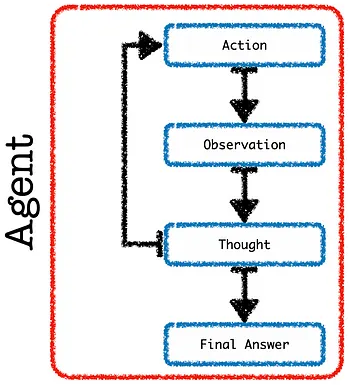

# Autonomous LLM Agents

Agents make use of pre-assigned tools in an autonomous fashion to perform one or more actions.
Agents follow a chain-of-thought reasoning approach.

In their simplest form:
- An agent is constituted by one or more tools.
- Tools enable an Agent to take certain actions.

## Autonomy
Agents are autonomous with regard to:
1. Decomposition of the problem via chain-of-thought reasoning.
2. The sequence in which tools are used.
3. How actions related to a tool are applied to each step of the problem.
4. Defining success or failure, and determining when the end of the chain is reached with a satisfactory answer.



## Python Implementation
Requirements
```shell copy
pip install langchain
pip install wikipedia
pip install openai
```
Agent
```python filename="autonomous_llm_agent.py" showLineNumbers copy
import os
from langchain import agents as langchain_agents
from langchain import llms as langchain_llms

# https://platform.openai.com/account/api-keys
os.environ["OPENAI_API_KEY"] = str("xxxxxxxx")

llm = langchain_llms.OpenAI(temperature=0, model_name="gpt-3.5-turbo")

tools = langchain_agents.load_tools(["wikipedia"], llm=llm)

agent = langchain_agents.initialize_agent(
    tools=tools,
    llm=llm,
    agent=langchain_agents.AgentType.ZERO_SHOT_REACT_DESCRIPTION,
    verbose=True,
)
agent.run(
    "What is the square root of the year of the founder of SpaceX and Tesla was born and what is the name of the first company he founded?"
)
```

Sample output
```shell
> Entering new AgentExecutor chain...
I need to find out the year the founder of SpaceX and Tesla was born and the name of the first company he founded.
Action: Wikipedia
Action Input: Elon Musk
Observation: Page: Elon Musk
Summary: Elon Reeve Musk ( EE-lon; born June 28, 1971) is a business magnate and investor. He is the founder, CEO, and chief engineer of SpaceX; angel investor, CEO and product architect of Tesla, Inc.; owner and CTO of Twitter; founder of the Boring Company; co-founder of Neuralink and OpenAI; and president of the philanthropic Musk Foundation. Musk is the wealthiest person in the world, with an estimated net worth, as of July 12, 2023, of around US$239 billion according to the Bloomberg Billionaires Index and $248.8 billion according to Forbes's Real Time Billionaires list, primarily from his ownership stakes in Tesla and SpaceX.Musk was born in Pretoria, South Africa, and briefly attended the University of Pretoria before moving to Canada at age 18, acquiring citizenship through his Canadian-born mother. Two years later, he matriculated at Queen's University in Kingston, Ontario, and two years after that transferred to the University of Pennsylvania, where he received bachelor's degrees in economics and physics. He moved to California in 1995 to attend Stanford University. After two days, he dropped out and, with his brother Kimbal, co-founded the online city guide software company Zip2. The startup was acquired by Compaq for $307 million in 1999, and with $12 million of the money he made, that same year Musk co-founded X.com, a direct bank. X.com merged with Confinity in 2000 to form PayPal.
In 2002, eBay acquired PayPal for $1.5 billion, and that same year, with $100 million of the money he made, Musk founded SpaceX, a spaceflight services company. In 2004, he was an early investor in the electric vehicle manufacturer Tesla Motors, Inc. (now Tesla, Inc.). He became its chairman and product architect, assuming the position of CEO in 2008. In 2006, he helped create SolarCity, a solar energy company that was acquired by Tesla in 2016 and became Tesla Energy. In 2013, Musk proposed a hyperloop high-speed vactrain transportation system. In 2015, he co-founded OpenAI, a nonprofit artificial intelligence research company. The following year, he co-founded Neuralink—a neurotechnology company developing brain–computer interfaces—and the Boring Company, a tunnel construction company. In 2022, his acquisition of Twitter for $44 billion was completed. In 2023, Musk founded xAI, an artificial intelligence company.
Musk has expressed views that have made him a polarizing figure. He has been criticized for making unscientific and misleading statements, including that of spreading COVID-19 misinformation. In 2018, the U.S. Securities and Exchange Commission (SEC) sued Musk for falsely tweeting that he had secured funding for a private takeover of Tesla. To settle the case, Musk stepped down as chairman of Tesla and paid a $20 million fine.

Page: Acquisition of Twitter by Elon Musk
Summary: Business magnate Elon Musk initiated an acquisition of American social media company Twitter, Inc. on April 14, 2022, and concluded it on October 27, 2022. Musk had begun buying shares of the company in January 2022, becoming its largest shareholder by April with a 9.1 percent ownership stake. Twitter invited Musk to join its board of directors, an offer he initially accepted before declining. On April 14, Musk made an unsolicited offer to purchase the company, to which Twitter's board initially responded with a "poison pill" strategy to resist a hostile takeover, before unanimously accepting Musk's buyout offer of $44 billion on April 25. Musk stated that he planned to introduce new features to the platform, make its algorithms open-source, combat spambot accounts, and promote free speech.
In July, Musk announced his intention to terminate the agreement, asserting that Twitter had breached their agreement by refusing to crack down on spambot accounts. The company filed a lawsuit against Musk in the Delaware Court of Chancery shortly thereafter, with a trial scheduled for the week of October 17. Weeks before the trial was set to begin
Thought:I have found the information I need.
Action: Wikipedia
Action Input: Zip2
Observation: Page: Zip2
Summary: Zip2 was a company that provided and licensed online city guide software to newspapers. The company was founded in Palo Alto, California as Global Link Information Network in 1995, by Greg Kouri and brothers Elon and Kimbal Musk. Initially, Global Link provided local businesses with an Internet presence,: 61  but later began to assist newspapers in designing online city guides before being purchased by Compaq Computer in 1999.

Page: X.com
Summary: X.com was an online bank co-founded by Elon Musk, Harris Fricker, Christopher Payne, and Ed Ho in 1999 in Palo Alto, California. In 2000, X.com merged with competitor Confinity Inc., a software company also based in Palo Alto. Musk was attracted to Confinity because of its easy payment system. The merged company changed its name to PayPal. eBay bought PayPal for US$1.5 billion in 2002. In 2015, PayPal was spun off and became an independent company.
```
