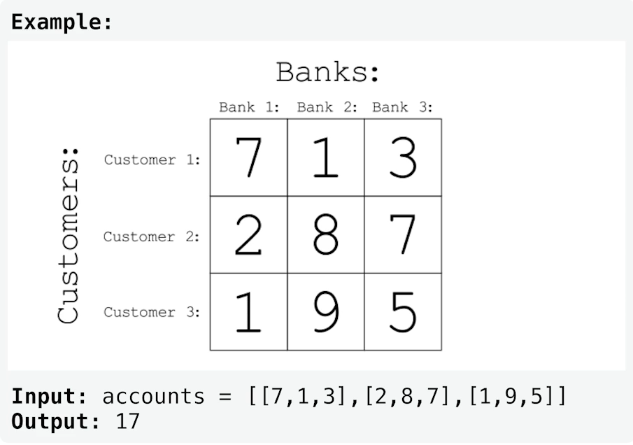

# Two-Dimensional Arrays

## Terminology

### Vector
Containers that are implemented as dynamic arrays.

A vectors storage is handled automatically, allowing it to be expanded and contracted as needed.  (Similarly to a Python list)

---
## Challenges

### Richest Customer Wealth

You are given an `m * n` integer grid `accounts` where
`accounts[i][j]` is the amount of money the `i`<sup>th</sup> customer has in the `j`<sup>th</sup> bank.

Return the wealth that the richest customer has.

The customer's wealth is the amount of money they have in all their bank accounts.
The richest customer is the customer that has the maximum wealth.

## Complexities
Time Complexity: `O(n x m)`
-  We must traverse over n customers and traverse over m banks to find the sum.

Space Complexity: `O(1)`
- Constant because we do not create a new data structure proportional in size to find a solution.



### Python Solution
```python
def maximum_wealth(accounts: list[list[int]]) -> int:
    max_wealth = 0
    for account in accounts:
        customer_wealth = sum(account)
        if customer_wealth > max_wealth:
            max_wealth = customer_wealth
    return max_wealth
```
