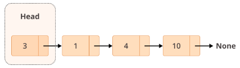

# Linked Lists

Linked lists are an ordered collection of objects.

- Lists: Use a contiguous memory block to store references to their data.
- Linked lists: Store references as part of their own elements.  Each link is an instance of its own.

## Main Concepts

Each element of a linked list is called a node, and every node has two different fields:
1. Data - contains the value to be stored in the node.
2. Next - contains a reference to the next node on the list.

A linked list is a collection of nodes.
The first node is called the head, and it's used as the starting point for any iteration through the list.
The last node must have its next reference pointing to None to determine the end of the list.

Here's how it looks:

